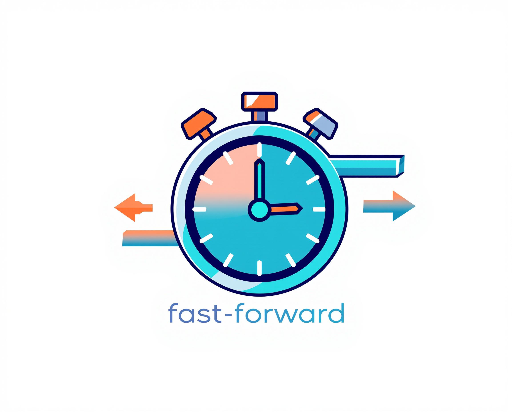

# fast-forward

<p align="center">
  
</p>

A TypeScript library that wraps objects in a cache-aware Proxy for faster method calls. Similar to VCR, snapshot libraries, and request recording tools, fast-forward makes testing faster by caching method calls to avoid expensive operations during repeated test runs.

[](https://opensource.org/licenses/MIT)

## Features

- Transparently caches method calls using a Proxy
- Cache hits return previous results immediately without re-execution
- Supports in-memory caching (default) and persistent filesystem caching
- Full TypeScript support with preserved types
- Minimal dependencies
- 100% test coverage

## Installation

```bash
npm install fast-forward
```

## Usage

```typescript
import { fastForward as ff, FileSystemCache } from 'fast-forward';

// Create an object with expensive methods
const calculator = {
  add: (a: number, b: number): number => {
    console.log('Calculating add...');
    return a + b;
  },
  
  fibonacci: (n: number): number => {
    console.log(`Calculating fibonacci(${n})...`);
    if (n <= 1) return n;
    return calculator.fibonacci(n - 1) + calculator.fibonacci(n - 2);
  }
};

// Wrap the object with fast-forward using in-memory cache (default)
const cachedCalculator = ff(calculator);

// Or use FileSystemCache for persistence between runs
const fsCache = new FileSystemCache();
const persistentCalculator = ff(calculator, { cache: fsCache });

// You can also specify a cache mode
import { CacheMode } from 'fast-forward';
// This will always compute fresh results (never use cache)
const noCacheCalculator = ff(calculator, { mode: CacheMode.OFF });
// This will always compute fresh results but store them for future use
const updateOnlyCalculator = ff(calculator, { mode: CacheMode.UPDATE_ONLY });
// This will only read from cache and never compute
const readOnlyCalculator = ff(calculator, { mode: CacheMode.READ_ONLY });

// First call - will execute the original method and cache the result
console.log(cachedCalculator.add(2, 3)); // Logs: "Calculating add..." then "5"

// Second call with same arguments - returns from cache without execution
console.log(cachedCalculator.add(2, 3)); // Logs: "5" (no "Calculating" message)

// Different arguments - will execute the original method
console.log(cachedCalculator.add(4, 5)); // Logs: "Calculating add..." then "9"

// The caching is particularly useful for expensive recursive calls
console.log(cachedCalculator.fibonacci(5)); // Will only calculate each fibonacci(n) once
```

### OpenAI Integration Example

fast-forward is particularly useful for testing applications that use API clients like OpenAI:

```typescript
import { fastForward as ff, FileSystemCache } from 'fast-forward';
import OpenAI from 'openai';

// Create the OpenAI client
const openai = new OpenAI({
  apiKey: process.env.OPENAI_API_KEY,
});

// Wrap it with fast-forward using a filesystem cache with "openai" namespace
const fsCache = new FileSystemCache({ namespace: 'openai' });
const cachedOpenAI = ff(openai, { cache: fsCache });

// First call will make a real API request
const response1 = await cachedOpenAI.chat.completions.create({
  model: 'gpt-4',
  messages: [{ role: 'user', content: 'Hello, world!' }],
});
console.log('First call (real API request):', response1.choices[0].message.content);

// Subsequent calls with the same parameters will return cached results instantly
// without making actual API requests or counting against your rate limits
const response2 = await cachedOpenAI.chat.completions.create({
  model: 'gpt-4',
  messages: [{ role: 'user', content: 'Hello, world!' }],
});
console.log('Second call (from cache):', response2.choices[0].message.content);

// If you want to force a fresh API call but still update the cache:
import { CacheMode } from 'fast-forward';
// Create a force-update wrapper that always calls the API but saves results
const forceUpdateOpenAI = ff(openai, { 
  cache: fsCache, 
  mode: CacheMode.UPDATE_ONLY 
});

// This will always call the API even if cached
const freshResponse = await forceUpdateOpenAI.chat.completions.create({
  model: 'gpt-4',
  messages: [{ role: 'user', content: 'Hello, world!' }],
});
console.log('Force update call:', freshResponse.choices[0].message.content);
```

This approach is ideal for testing, as it allows you to:
1. Record real API responses during the first test run
2. Use cached responses in subsequent runs for faster tests
3. Avoid API rate limits and costs during development


### Promise Support

fast-forward works seamlessly with async methods:

```typescript
import { fastForward as ff } from 'fast-forward';

const api = {
  fetchUser: async (id: string) => {
    console.log(`Fetching user ${id}...`);
    // Simulate API call
    await new Promise(resolve => setTimeout(resolve, 1000));
    return { id, name: 'User ' + id };
  }
};

const cachedApi = ff(api);

// First call - executes the method and logs "Fetching user 123..."
const user1 = await cachedApi.fetchUser('123'); // Takes 1 second

// Second call - returns from cache without execution
const user2 = await cachedApi.fetchUser('123'); // Instant response!

// Result is still a Promise even when served from cache
console.log(cachedApi.fetchUser('123') instanceof Promise); // true
```

Failed promises (rejections) are not cached, so they will be retried on subsequent calls.

## Advanced Usage

### Cache Modes

fast-forward supports different cache operation modes to control caching behavior:

```typescript
import { fastForward as ff, CacheMode, FileSystemCache } from 'fast-forward';

const calculator = {
  add: (a: number, b: number) => {
    console.log('Calculating...');
    return a + b;
  }
};

// Normal mode (default) - read from cache if available, otherwise compute and store
const cachedCalculator = ff(calculator, { mode: CacheMode.ON });

// Disable caching completely - always compute fresh results and don't store them
const noCache = ff(calculator, { mode: CacheMode.OFF });

// Force update mode - always compute fresh results but store them for future use
const forceUpdate = ff(calculator, { mode: CacheMode.UPDATE_ONLY });

// Read-only mode - only read from cache, don't compute if not found
const readOnly = ff(calculator, { mode: CacheMode.READ_ONLY });

// Use both a custom cache and a specific mode
const fsCache = new FileSystemCache();
const customOptions = ff(calculator, { 
  cache: fsCache,
  mode: CacheMode.UPDATE_ONLY 
});
```

You can also control cache behavior via the `FASTFORWARD_MODE` environment variable:

```bash
# Set mode in your environment
export FASTFORWARD_MODE=OFF  # Valid values: ON, OFF, UPDATE_ONLY, READ_ONLY

# Run your application
node my-app.js
```

This environment variable approach is especially useful for testing scenarios where you want to temporarily modify caching behavior without changing code. Note that explicit options passed to the `fastForward` function will override the environment variable settings.

### Cache Implementations

fast-forward provides two cache implementations:

```typescript
import { fastForward as ff, FileSystemCache, InMemoryCache } from 'fast-forward';
import * as path from 'path';

// By default, fastForward uses InMemoryCache (no persistence)
const defaultCalculator = ff(calculator);

// Explicitly use in-memory cache 
const inMemoryCache = new InMemoryCache();
const memoryCalculator = ff(calculator, { cache: inMemoryCache });

// For backward compatibility, you can still pass a cache implementation directly
const legacyStyle = ff(calculator, inMemoryCache);

// Use FileSystem cache for persistence between application runs
const fsCache = new FileSystemCache();
const persistentCalculator = ff(calculator, { cache: fsCache });

// Use FileSystem cache with a custom directory
const customFsCache = new FileSystemCache({
  cacheDir: path.join(process.cwd(), '.my-custom-cache')
});
const customDirCalculator = ff(calculator, { cache: customFsCache });
```

#### FileSystemCache

A persistent cache that stores method results to disk. Each cache entry is stored as a JSON file in the `.fastforward-cache` directory (overridable default, created automatically). This provides several benefits:

1. Persistence across application restarts
2. Human-readable cache files for debugging
3. Easy sharing between processes

To avoid tracking cache files in your repository, add this to your `.gitignore`:

```
.fastforward-cache/
```

### Custom Cache

You can also provide a custom cache implementation to control cache behavior:

```typescript
import { fastForward as ff, type Cache } from 'fast-forward';

// Create a custom cache with a max size
class LRUCache implements Cache {
  private cache = new Map<string, any>();
  private maxSize: number;
  
  constructor(maxSize: number = 100) {
    this.maxSize = maxSize;
  }
  
  get(key: string): any | undefined {
    return this.cache.get(key);
  }
  
  set(key: string, value: any): void {
    if (this.cache.size >= this.maxSize) {
      // Remove oldest entry in a real LRU implementation
      const firstKey = this.cache.keys().next().value;
      this.cache.delete(firstKey);
    }
    this.cache.set(key, value);
  }
  
  has(key: string): boolean {
    return this.cache.has(key);
  }
}

const cachedCalculator = ff(calculator, { cache: new LRUCache(50) });
```

## API Reference

### fastForward(target, options?)

Wraps an object with a cache-aware Proxy.

- `target`: The object to wrap
- `options?`: Either a Cache implementation (for backward compatibility) or FastForwardOptions:
  - `cache?`: Optional cache implementation (defaults to InMemoryCache)
  - `mode?`: Optional cache mode (defaults to CacheMode.ON)
- Returns: A proxied version of the target with caching

### CacheMode

An enum defining different caching behaviors:

- `CacheMode.ON`: Normal caching (default) - read from cache if available, compute and store if not
- `CacheMode.OFF`: Disable caching completely - always compute fresh results, don't store
- `CacheMode.UPDATE_ONLY`: Force update mode - always compute fresh results but store for future use
- `CacheMode.READ_ONLY`: Read-only mode - only read from cache, return undefined if not found

### InMemoryCache

A non-persistent cache implementation using JavaScript's Map.

### FileSystemCache

A persistent cache implementation that stores entries as JSON files.

```typescript
// Create a FileSystem cache with default directory (.fastforward-cache)
const defaultCache = new FileSystemCache();

// Create with a custom directory
const customCache = new FileSystemCache({
  cacheDir: path.join('.my-cache-dir')
});

// Create distinct namespaces within the same directory
const userCache = new FileSystemCache({
  namespace: "s3-client"
});

// Use it with fast-forward
const cachedObj = ff(obj, { cache: customCache });
```

### Environment Variables

- `FASTFORWARD_MODE`: Set the cache mode globally. Valid values: `ON`, `OFF`, `UPDATE_ONLY`, `READ_ONLY`. 
  This provides a default mode when no explicit mode is specified in code. If a mode is explicitly passed to the `fastForward` function, it will override this environment variable.

## License

MIT
